# Real-Time Distributed Object Tracking Pipeline

[](https://www.python.org/)
[](https://pytorch.org/)
[](https://github.com/psf/black)
[](./LICENSE)

A proof-of-concept distributed system for real-time video analysis. This project simulates a modern data pipeline for surveillance or C2 (Command and Control) applications, built on a scalable, message-driven architecture. It ingests a video stream, performs intelligent object tracking, persists the data, and provides results for real-time visualization or post-processing.

---

<!-- ## 🎥 Live Demo

--- -->

## ✨ Key Features
* **Distributed Architecture:** A multi-service system fully orchestrated with Docker Compose, demonstrating a clean separation of concerns.
* **Asynchronous Messaging:** Utilizes **RabbitMQ** as a message broker to decouple services, handle backpressure, and ensure data resilience.
* **AI-Powered Processing:** Performs high-performance object detection using a **YOLOv8** model.
* **Stateful Object Tracking:** Implements the **SORT algorithm** via the `supervision` library to maintain a persistent ID for each detected object across frames.
* **Data Persistence:** Logs all track data (object ID, class, coordinates, timestamp) to an **SQLite** database for auditing and offline analysis.
* **Multiple Consumers:** Provides both a real-time local `viewer` and a headless `video_compiler` service to demonstrate the flexibility of the pub/sub architecture.

---

## 🏗️ System Architecture
The system is designed as a decoupled pipeline where services communicate asynchronously via a central message broker. This design allows for independent scaling of components and makes the system resilient to individual service failures.

```mermaid
graph LR
    %% -- Define Style Classes for consistency --
    classDef service fill:#e1effa,stroke:#367dca,stroke-width:2px;
    classDef broker fill:#ffe8d1,stroke:#f5a623,stroke-width:2px;
    classDef data fill:#f4f4f4,stroke:#333,stroke-width:2px;
    classDef queue fill:#fff2cc,stroke:#f5a623,stroke-width:1px;

    %% -- Define Components --
    subgraph Host Machine
        InputVideo[▶️ test_video.mp4]:::data;
        Viewer(🖥️ Local Viewer):::service;
    end

    subgraph Docker Environment
        Publisher(Publisher Service):::service;
        RabbitMQ{RabbitMQ Broker}:::broker;
        Worker(🔬 Worker Service <br/> YOLO + SORT):::service;
        Database[(SQLite DB)]:::data;
        Compiler(🎬 Video Compiler):::service;
        OutputVideo[🏆 annotated_video.mp4]:::data;

        subgraph RabbitMQ
            direction TB;
            FrameQueue[frame_queue]:::queue;
            ResultsQueue[results_queue]:::queue;
        end
    end
    
    %% -- Define Data Flow --
    InputVideo -- Reads --> Publisher;
    Publisher -- JPEG Frames --> FrameQueue;
    FrameQueue --> Worker;
    Worker -- Track Data --> Database;
    Worker -- Annotated Frames --> ResultsQueue;
    ResultsQueue --> Viewer;
    ResultsQueue --> Compiler;
    Compiler -- Creates --> OutputVideo;
```



1. The **Publisher** reads the source video, encodes frames to JPEG, and sends them to the `frame_queue`.
2. The **Worker** consumes frames, performs YOLO detection + SORT tracking, saves track data to the SQLite database (which it initializes on first run), and publishes the final annotated frames to the `results_queue`.
3. The **Local Viewer** and **Video Compiler** are independent consumers of the `results_queue`.

---

## 🛠️ Technology Stack
* **Backend:** Python
* **AI / Computer Vision:** PyTorch, Ultralytics YOLOv8, OpenCV, Supervision, SORT
* **Messaging:** RabbitMQ, Pika
* **Database:** SQLite
* **Containerization:** Docker, Docker Compose

---

## 🚀 Setup & Usage
This project is fully containerized. The only prerequisites are **Docker** and **Docker Compose**.

### 1. Configuration
```bash
# Clone the repository
git clone https://github.com/nicdeluc/distributed-yolo-tracker.git
cd YOUR_REPO

# Create a 'data' directory for your input video
mkdir data

# Download or place your test video file inside the 'data' directory
# (e.g., place your test_video.mp4 file in the data/ folder).
# You can also edit the video path in the config/config.yaml file.
```

### 2. Running the Application
The entire pipeline is managed by `docker-compose`.

```bash
# 1. Build all the service images
docker-compose build

# 2. Launch the main pipeline (publisher and worker)
# The worker will automatically initialize the database on its first run.
docker-compose up publisher worker
```
The services will now run until the video has been fully processed.

### 3. Viewing the Results

You have two options to see the output:

**Option A: Real-Time Viewer (Run while the pipeline is active)**
1.  In a **new, separate terminal**, navigate to the project directory and activate your local Python virtual environment.
2.  Run the viewer script:
    ```bash
    python app/viewer.py
    ```
    A window will pop up showing the live, annotated video feed.

**Option B: Compile the Final Video (Run after the pipeline is finished)**
1.  Once the publisher has finished, stop the running services with `Ctrl+C`.
2.  Run the video compiler script as a one-off task:
    ```bash
    docker-compose run --rm worker python app/video_compiler.py
    ```
    The final video (`annotated_video.mp4`) will be saved in your `output/` directory.

### 4. Cleaning Up
To stop and remove all containers, run:
```bash
docker-compose down
```
---

## 🔮 Possible Future Improvements
This project serves as a strong foundation. Potential future enhancements include:

* **Live Demo:** Implement a user-friendly live demo using **Gradio** that takes a video and outputs the corresponding annotated video.
* **Model Optimization:** Implementing **INT8 quantization** with TensorFlow Lite or TensorRT to reduce model size and improve inference speed for edge deployment.
* **Replacing SQLite with PostgreSQL** for a more robust, production-grade database that can handle concurrent writes more effectively.
* **Implementing a more advanced tracker** like DeepSORT for better handling of object occlusions.
* **Adding a metrics pipeline** using Prometheus and Grafana to monitor system performance (e.g., queue depth, processing latency).
* **Adding a CI/CD Pipeline** with GitHub Actions to automate linting, testing, and image building.

---

## 📜 License
This project is licensed under the MIT License. See the `LICENSE` file for details.